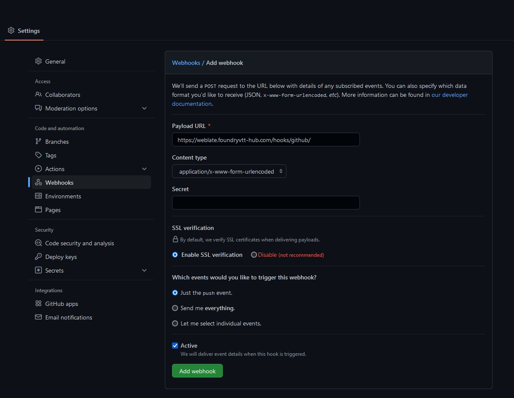
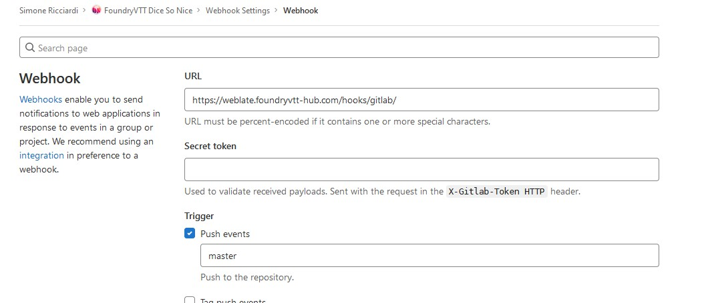

## Requirements
To get your package translated on Foundry Hub Weblate, there are a few requirements you need to meet:
- Your package must be free to use.
- Your package must be hosted on a public GitHub or Gitlab repository.
- The repository must contains at least one language file to use as a source for translation.

## How does it work?
When a package is added to Foundry Hub Weblate, it will automatically become available for translation to anyone with a registered account. You can start translating your package right away, or you can wait for someone else to start translating it.  

24 hours after any translation is added or changed in your project, Weblate will create a Pull Request on your repository to update the translation.

Alternatively, you can manually force a translation Pull Request with your project admin access.

> If a new language is added to your project, Weblate will automatically create a new language file in your repository and update your manifest file.

## How to get your package translated on Foundry Hub Weblate
Adding your package to Foundry Hub Weblate is easy and does not require any credentials or authentication on your part.

Just send us an email at [admin@foundryvtt-hub.com](mailto:admin@foundryvtt-hub.com) with the following information:

- Package name:
- Package repository URL:
- Repository branch:
- Weblate username:
- Space or tabs for indentation:
- How many space of tabs per indentation level:
- What is the source language of your package:

Once we receive your request, we will review it and setup a Weblate project for you.
The only configuration you need to do if you wish to automatically update your Weblate project when you change the source language is to add a Webhook to your repository.

### Automatically receive changes from GitHub
To receive notifications on every push to a GitHub repository, add the Weblate Webhook in the repository settings `Webhooks` as shown on the image below:

  
View screenshot

> The GitHub Webhook URL is: `https://weblate.foundryvtt-hub.com/hooks/github/`

### Automatically receive changes from Gitlab
To receive notifications on every push to a Gitlab repository, add the Weblate Webhook in the repository settings `Webhooks` as shown on the image below:

  
View screenshot

> The Gitlab Webhook URL is: `https://weblate.foundryvtt-hub.com/hooks/gitlab/`
