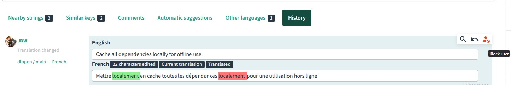

## Promote your Weblate project
Make sure you inform your users about your Weblate project to get them involved.  
There are two places to do this: on your repository's README and on your Foundry VTT package page.

### The Engage page
The Engage page is a great place to send users to if you want to get them involved with your localization project.  
Navigate to your project on Weblate and click the `Share` button, then click the `Engage page` button.  
You can share this link with your users so they can join your translation community.  

> Example: [https://weblate.foundryvtt-hub.com/engage/dice-so-nice/](https://weblate.foundryvtt-hub.com/engage/dice-so-nice/)

### Badges and status widgets
Weblate provides a number of widgets that can be used to show the status of your project.  
Head to your project on Weblate and click the `Share` button, then click the `Status widgets` button.  

From there, you can choose which widgets you want to show and select the language you want your widgets in.

#### Examples
> Shield:  
>   
> Widget:   
> 

## Maintain your Weblate project
While Weblate can't directly modify your package files without you merging them into your repository, you should keep an eye on your Weblate project to make sure nobody is messing with your translations.  
Should it be the case, you can easily revert your translations back to previous revision as every Weblate project is versioned.  
You can also block a user from translating your project by clicking the `Block user` button.

## Manually push updates to your repository
If you need to update your repository without waiting for a Weblate update, you can manually push your translations to your repository.  
Head to the component you want to push on Weblate and click the `Manage` button, then click the `Repository maintenance` button.

From there, first click the `Commit` button if there are any changes to your translations.  
Then click the `Push` button.

## Provide translation instructions
You can provide translation instructions for your project on Weblate.  
Go to your project on Weblate and click the `Manage` button, then click the `Settings` button.

Enter your translation instructions in the corresponding text area. You can use Markdown to format your instructions.

## Learn more about Weblate features
There is a lot more to learn about Weblate. Check out the [Weblate documentation](https://docs.weblate.org/en/latest/) for more information.